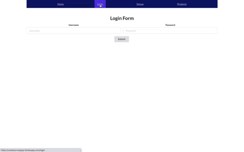
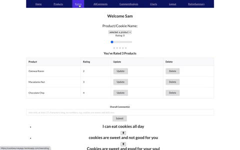

# README

<!-- \*Backend of cookie survey app built with Ruby on Rails Active Record Framework.

\*Used postgresql as the database for Active Record.

\*Used external/third-party API; IBM Watson Natural Language Understanding (NLU).

\*IBM Watson NLU was used to analyze comments for sentiments and emotions. -->

\*Link to Cookie Survey App on Heroku [Cookie Survey App on Heroku](https://cookiesurveyapp.herokuapp.com/)

<h1 align="center">Cookie Survey App🥛🍪 </h1>

  A <code>React</code> web app where cookies lovers everywhere can rate their favorites cookies 

  
 🧭Explore:
    <a href="https://youtu.be/xOLTZ-pW3Qo">Demo</a> || 
    <a href="https://github.com/ajshemi/iSurveyApp_Reduxfrontend_Heroku">Frontend</a>
  

 

## Tech Stack

This web app makes use of the following:

**Backend**

- Ruby [2.6.1]
- Rails [~> 5.2.3] - MVC web framework used as an API
- Bcrypt [~> 3.1.7] - Gem for encryption and securing user passwords
- Dotenv - Rails gem for securing API Keys
- IBM Watson SDK - IBM Watson Natural Language Understanding (NLU).
- Active Model Serializers - Serializing API routes to JSON
- JWT - securing tokens
- PostgreSQL [>= 0.18, < 2.0] - Database

[**Front End**](https://github.com/ajshemi/iSurveyApp_Reduxfrontend_Heroku)

- React.js
- React Router - Declarative Routing
- React Redux - State Management
- Semantic UI React
- Chart.js - Charts and Plots
<!-- - Custom CSS3 styling -->

## Installing

<!-- _Note: Without Stripe API key, Google Maps API key and Yelp API key, the project will not function to it's fullest potential_  -->

**Backend Installation:**

- Clone this repo to your local machine `git clone <backend-repo-url>`
- run `bundle install` to install required dependencies
- Ensure you have PostgreSQL running
- run `rails db:create` to create a database locally.
- run `rails db:migrate` to create tables into the database.
- run `rails db:seed` to create seed data.
- run `rails s` to run the server.

**Frontend Installation:**

- Clone [frontend repo](https://github.com/ajshemi/iSurveyApp_Reduxfrontend_Heroku) to your local machine `git clone <frontend-repo-url>`
- Ensure your Backend API is running at `http://localhost:3000/`
- run `npm install` to install all dependencies
- run `npm start` to start server
- When prompted, ensure Frontend is running at `http://localhost:3001`

## Features

Cookie survey app home page.

</p
